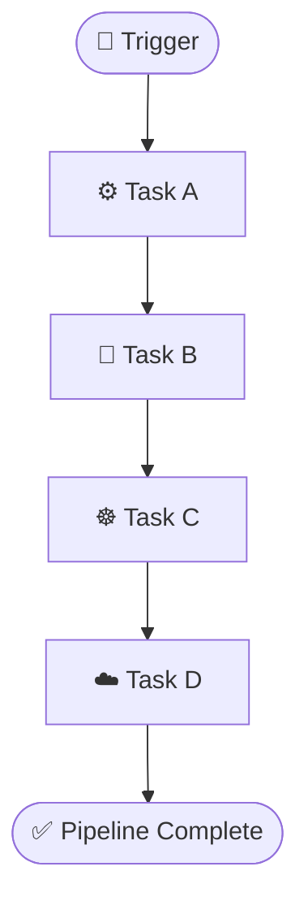

<div align="center">


<br>
<br>

<div align="center">
  
</div>

<br>

<h1>SHOGUN KUBER X (formerly Pipeline X)</h1>

<h3>Cloud-Native Pipeline Orchestration Platform</h3>

<p>
Containerized workflow orchestration designed around
<strong>Docker</strong>, <strong>Kubernetes</strong> and
<strong>Amazon EKS</strong>.
</p>

<br><br>


<br><br>

<br>

<a href="https://aws.amazon.com/">

</a>

<br><br>


</div>

---

# 🚀 SHOGUN KUBER X

**SHOGUN KUBER X**, formerly known as **Pipeline X**, is a cloud-native pipeline orchestration platform designed to automate, schedule, manage and execute containerized workflows.

The project combines:

- 🐳 Docker
- ☸️ Kubernetes
- ☁️ Amazon EKS
- 🔄 Workflow orchestration
- 🧩 DAG-based dependency management
- ⏱️ Scheduling
- 🔔 Event-driven execution
- 📦 Containerized workloads
- 📈 Scalable cloud infrastructure

The goal is to create a flexible orchestration architecture capable of running complex multi-step workflows in a distributed cloud environment.

---

# 🎯 Project Vision

The primary vision of **SHOGUN KUBER X** is to provide a structured orchestration layer for modern cloud-native workloads.

Instead of manually executing individual applications or scripts, SHOGUN KUBER X organizes workloads into pipelines.

A pipeline can contain multiple tasks such as:


---

# 🛠️ Tools & Technologies Used

<div align="center">

<table>
<tr>
<td align="center" width="180">

<br><strong>Docker</strong>
<br>Containerization
</td>

<td align="center" width="180">

<br><strong>Kubernetes</strong>
<br>Orchestration
</td>

<td align="center" width="180">

<br><strong>AWS</strong>
<br>Cloud Platform
</td>

<td align="center" width="180">

<br><strong>Linux</strong>
<br>Runtime Environment
</td>
</tr>

<tr>
<td align="center">

<br><strong>Git</strong>
<br>Version Control
</td>

<td align="center">

<br><strong>GitHub</strong>
<br>Repository
</td>

<td align="center">

<br><strong>VS Code</strong>
<br>Development
</td>

<td align="center">

<br><strong>Bash</strong>
<br>Automation
</td>
</tr>
</table>

</div>

---

# 💻 Programming Languages

<div align="center">

<table>
<tr>
<td width="200"><strong>YAML</strong></td>
<td width="500">
<svg width="400" height="22">
<rect width="360" height="22" rx="10" fill="#cb171e"/>
</svg>
</td>
<td><strong>90%</strong></td>
</tr>

<tr>
<td><strong>Python</strong></td>
<td>
<svg width="400" height="22">
<rect width="320" height="22" rx="10" fill="#3776AB"/>
</svg>
</td>
<td><strong>80%</strong></td>
</tr>

<tr>
<td><strong>Bash</strong></td>
<td>
<svg width="400" height="22">
<rect width="280" height="22" rx="10" fill="#4EAA25"/>
</svg>
</td>
<td><strong>70%</strong></td>
</tr>

<tr>
<td><strong>Dockerfile</strong></td>
<td>
<svg width="400" height="22">
<rect width="280" height="22" rx="10" fill="#2496ED"/>
</svg>
</td>
<td><strong>70%</strong></td>
</tr>

<tr>
<td><strong>HTML</strong></td>
<td>
<svg width="400" height="22">
<rect width="200" height="22" rx="10" fill="#E34F26"/>
</svg>
</td>
<td><strong>50%</strong></td>
</tr>

</table>

</div>

---

# 📊 Technology Usage

<div align="center">

### ☸️ Kubernetes — 90%

<svg width="600" height="28">
<rect width="540" height="28" rx="14" fill="#326CE5"/>
<text x="555" y="20" fill="white" font-size="16">90%</text>
</svg>

### 🐳 Docker — 90%

<svg width="600" height="28">
<rect width="540" height="28" rx="14" fill="#2496ED"/>
<text x="555" y="20" fill="white" font-size="16">90%</text>
</svg>

### ☁️ Amazon EKS — 85%

<svg width="600" height="28">
<rect width="510" height="28" rx="14" fill="#FF9900"/>
<text x="525" y="20" fill="white" font-size="16">85%</text>
</svg>

### 🧩 DAG Orchestration — 85%

<svg width="600" height="28">
<rect width="510" height="28" rx="14" fill="#6C63FF"/>
<text x="525" y="20" fill="white" font-size="16">85%</text>
</svg>

### 🐍 Python — 80%

<svg width="600" height="28">
<rect width="480" height="28" rx="14" fill="#3776AB"/>
<text x="495" y="20" fill="white" font-size="16">80%</text>
</svg>

### 🖥️ Bash — 70%

<svg width="600" height="28">
<rect width="420" height="28" rx="14" fill="#4EAA25"/>
<text x="435" y="20" fill="white" font-size="16">70%</text>
</svg>

</div>

---

# 🧰 Development Tools

| Tool | Purpose |
|---|---|
| 🐳 Docker | Build and package applications into containers |
| ☸️ Kubernetes | Container orchestration |
| ☁️ Amazon EKS | Managed Kubernetes infrastructure |
| 🟧 AWS CLI | AWS resource management |
| 🔧 kubectl | Kubernetes cluster management |
| 🐙 Git | Source-code version control |
| 🐙 GitHub | Repository and collaboration |
| 💻 VS Code | Development environment |
| 🐧 Linux | Cloud/server environment |
| 🖥️ Bash | Automation and deployment scripts |
| 📄 YAML | Kubernetes and pipeline configuration |
| 🧩 DAG | Workflow dependency management |

---

# 🚚 Delivery Operations

The **Delivery Tracking** module monitors regional endpoints across India, including Delhi, Mumbai, Bengaluru, Hyderabad, and Kolkata. It provides five-second analytics polling, Google Maps endpoint views, urgent browser notifications, JWT-protected status updates, and local cache/offline queue support.

## Run With PostgreSQL

```powershell
Copy-Item .env.example .env
docker compose up --build
```

For the Google Maps view, set `VITE_GOOGLE_MAPS_API_KEY` before building the frontend. The key should be restricted to the Maps Embed API and approved web origins.

## Deploy To AWS EKS

```powershell
docker build -t shogun-kuber-x .
aws ecr get-login-password --region us-east-1 | docker login --username AWS --password-stdin YOUR_ACCOUNT_ID.dkr.ecr.us-east-1.amazonaws.com
docker tag shogun-kuber-x:latest YOUR_ACCOUNT_ID.dkr.ecr.us-east-1.amazonaws.com/shogun-kuber-x:latest
docker push YOUR_ACCOUNT_ID.dkr.ecr.us-east-1.amazonaws.com/shogun-kuber-x:latest
kubectl apply -f infra/eks-app.yaml
```

Use Amazon RDS for PostgreSQL and Kubernetes Secrets or AWS Secrets Manager for `JWT_SECRET`, `DATABASE_URL`, and Google Maps credentials in production.

---

# 🏗️ GitHub Repository Structure

```text
SHOGUN-KUBER-X/
│
├── 📁 .github/
│   └── 📁 workflows/
│       └── ⚙️ ci-cd.yml
│
├── 📁 assets/
│   ├── 🎞️ Shogun Kuber X.gif
│   └── 🖼️ AWS Advance Tier Training BADGE.png
│
├── 📁 docker/
│   ├── 🐳 Dockerfile
│   └── 📄 requirements.txt
│
├── 📁 orchestrator/
│   ├── 📁 scheduler/
│   ├── 📁 dag/
│   ├── 📁 executor/
│   └── 📁 controller/
│
├── 📁 pipelines/
│   ├── 📄 pipeline.yaml
│   └── 📁 examples/
│
├── 📁 kubernetes/
│   ├── 📄 namespace.yaml
│   ├── 📄 deployment.yaml
│   ├── 📄 service.yaml
│   ├── 📄 job.yaml
│   └── 📄 cronjob.yaml
│
├── 📁 scripts/
│   ├── 🖥️ build.sh
│   ├── 🖥️ deploy.sh
│   └── 🖥️ cleanup.sh
│
├── 📁 docs/
│   ├── 📄 architecture.md
│   └── 📄 deployment.md
│
├── 📄 .gitattributes
├── 📄 README.md
├── 📜 LICENSE
└── 🎥 SHOGUN KUBER X.mp4

```
<div align="center">

<h2>🛠️ Tools & Technologies</h2>


</div>

